<br/>

# eFit User Manual

```
Product Name:  eFit
Article Topic: Templating process
Last Update:   April, 2025
```

## Table of Contents

1. [Introduction](#introduction)
2. [General Concepts](#general-concepts)
3. [AI feature](#ai-feature)
   - [Autosizing](#autosizing)
5. [Manual Templating](#manual-templating)
   - [Knee](#knee)


## Introduction

eFit is Efferent’s solution for surgical planning, case management, and medical device logistics.
This cloud-based platform enables to collaborate more efficiently in the preparation and follow-up of orthopedic surgeries—especially those involving implants.
eFit automates key tasks such as template selection, implant compatibility verification and clinical documentation generation, helping reduce time and minimize errors associated with manual processes.


## General Concepts
Before diving into specific workflows, it's important to understand a few general concepts and tools that are consistently used across eFit. These elements appear throughout both the knee and hip workflows and are essential for navigating the interface and using the implant templating features effectively. The following sections explain these key components to help you get started.
### Laterality
The laterality buttons, available for both knee and hip workflows, allow you to select the side (left or right) you will be working on within the selected view. This setting determines which laterality the templates and adjustments will be applied to.

_View for Knee_:


### Orientation
The view orientation refers to the direction from which the image was captured and displayed. It is important for accurate templating and for ensuring that measurements and implant positioning are based on the correct anatomical perspective. In eFit, this is indicated as either AP or PA.
- **AP (Anteroposterior):** The X-ray beam enters the front (anterior) of the patient and exits though the back (posterior). This is the most common orientation used for imaging joint such as the knee and hip.

 - **PA (Posteroanterior):** The X-Ray beam enters from the back (posterior) and exits through the front (anterior) of the patient. PA views may be used depending on clinical preference or specific im
 aging requirements.

_View for hip_:

   

### Calibration

Whether the image comes pre-calibrated or not, calibration options are available to ensure accurate scaling and measurement.  A properly calibrated image is essential for selecting the correct implant size and achieving precise anatomical planning.

The Calibration tool provides several methods to calibrate the image, including Automatic sphere, manual sphere, line, and Oversize. Users can choose from different units of measurement—millimeters (mm), inches (in), or custom values—to match their preferred workflow or the reference standards used.

   

#### Auto Calibration
To use this option, the image must include calibration spheres, similar to those shown in the example in the previous image. If you're working with both views, ensure that each one contains its own calibration sphere for accurate results.

#### Manual Calibration
To access the Manual Calibration options, click on the "More" button to reveal the available methods. 

- **Calibration Sphere**:  choose the calibration measurement, click on start and follow the instructions to add the sphere.

   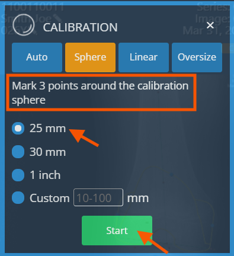

- **Calibration Line**: choose the calibration measurement, click on start and follow the instructions to add the line.

   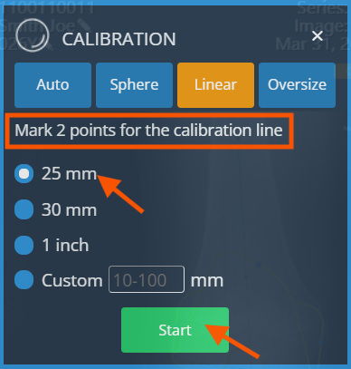

- **Oversize**: If no calibration devices (e.g., calibration spheres) are available, but the magnification percentage of the X-ray device is known, you can manually enter this value using the "Oversize" option.

   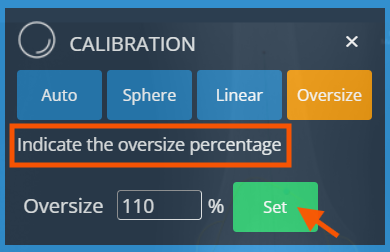

### Design Buttons

In the eFit module, you will find a set of buttons used to design the implant template. These tools enable you to create the necessary annotations that define the correct placement of the implant on the image. The buttons are arranged in a sequential order to guide you through the design process step by step.
Each time a button is selected, instructions appear below, indicating how to draw the corresponding annotation directly on the image. Following the sequence helps ensure acccurate and consistent implant planning.

   

### Implant Section

The implant section allows you to view and manage the implants selected for the templating process. This section includes a series of dropdown menus that allow you to select the manufacturer, product line, family and component size. 
After selecting the manufacturer and product line, family and size selection update the implant visualization on the image.

 

### Adjust

The Adjust button allows for fine-tuning the position of the selected implant. When clicked, a set of directional buttons appears—similar to a remote control—enabling you to make small, precise movements of the implant overlay.

These controls help you adjust the implant's final position on the image, ensuring optimal alignment with the anatomical structures. This tool is especially useful for making minor corrections after the initial placement.

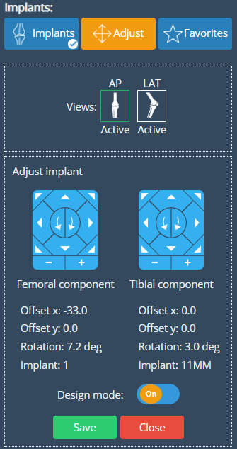

### Favorites

Users can save commonly used implants to a list of favorites for quicker access during the templating process. To save an implant, simply select the desired manufacturer, product line, and family, then click the star button. Once saved, the implant combination will be added to the favorites list, which can be accessed directly from the Favorites button in the implant section

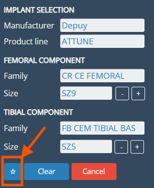

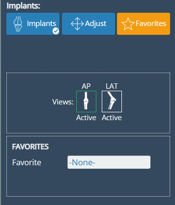

The list of saved favorites can be accessed from the ORTHO tab in the Settings menu. From this view, users can also create new favorites manually and manage existing ones—editing or removing entries as needed.

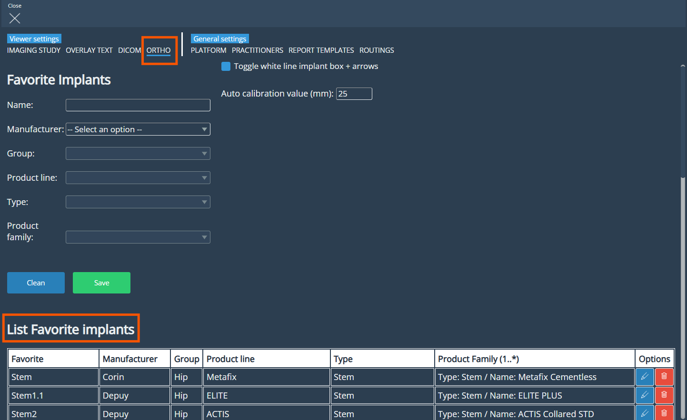

### Show in Print 

At the bottom of this panel, you will also find the "Show in print" switch. Enabling this option displays key implant information on the viewport in a yellow table. The table includes a drag handle, allowing you to reposition it freely within the image area.

At the bottom of this panel, you will also find the "Show in print" switch. Enabling this option displays key implant information on the viewport in a yellow table. This table contains the same measurement data shown when clicking the AP or LAT buttons. It also includes a drag handle, allowing you to reposition it freely within the image area.

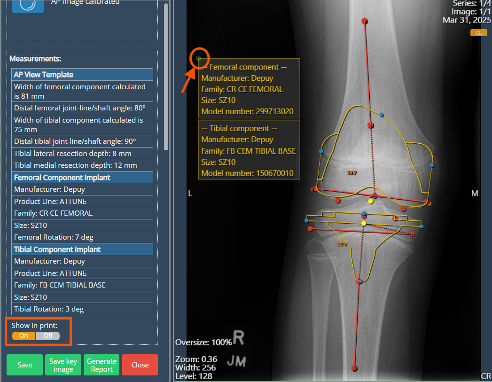

### Save Key image

Use this option to save a copy of the original image with the annotations included. If you later choose to remove the annotations from the original image, it will not affect the saved key images. When this option is used, a new series is automatically created to store all generated key images. These images can be identified by a key icon displayed in the upper-left corner.


### Generate Report

The report button allows you to generate a report containing the details of the selected implant template. During the report creation process, you can name the report, add or hide suggested fields from the default report template, and choose whether to include key images.

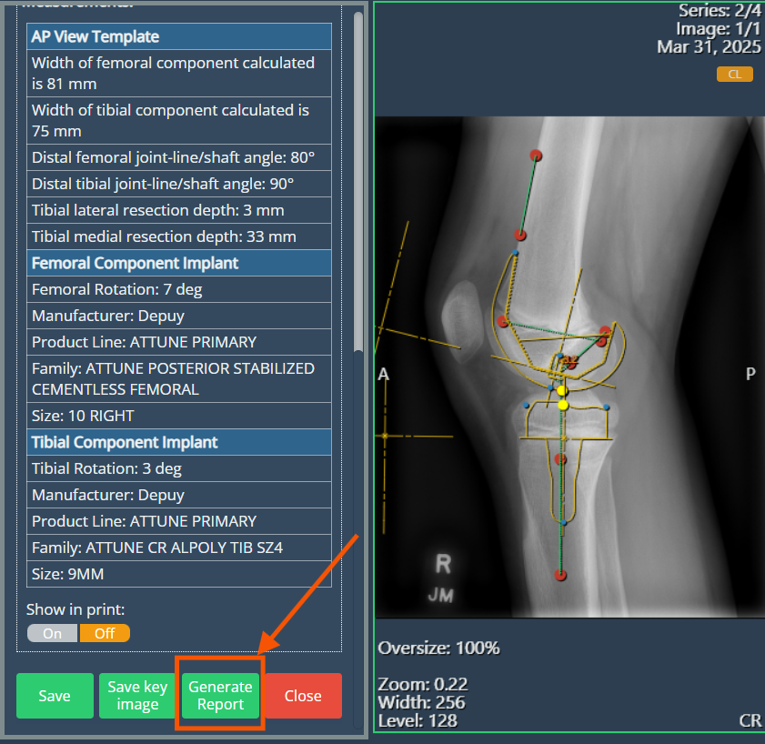

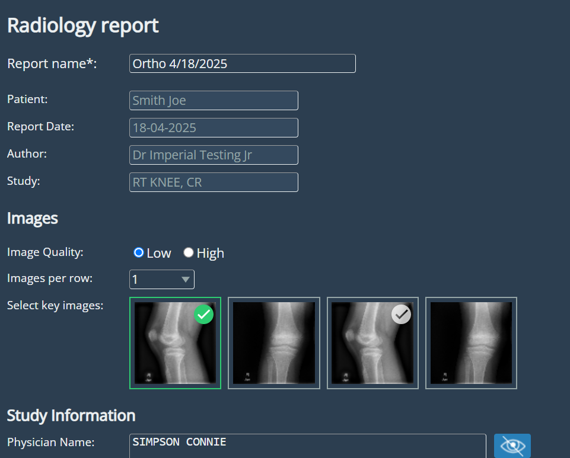

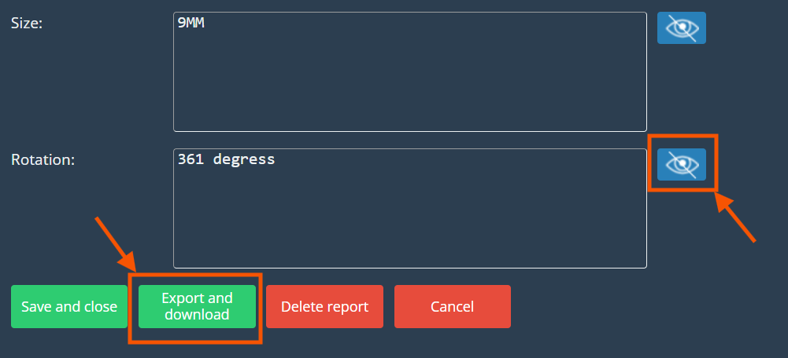

Once the report is customized as desired, you can export it using the "Export and Download" button. This provides a convenient way to document and share the planning details in a structured format.

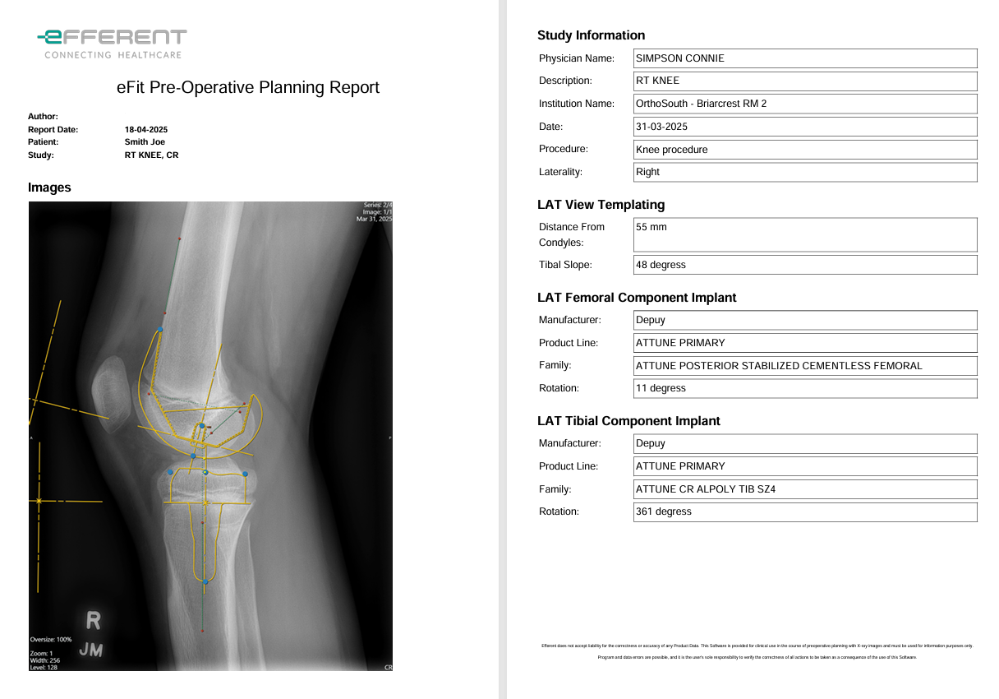

## AI Feature

The AI Mode offers the fastest and most practical way to generate a design, perform calculations, and receive suggestions for the most suitable implant and key measurements. Leveraging artificial intelligence, it determines the appropriate implant size and essential parameters for surgical planning, providing both semi-automatic and fully automatic sizing options.

With a single click, you can obtain an approximate result in seconds—streamlining what would otherwise require multiple manual steps. Note that the image must be properly calibrated.

_Click the IA button to run the process:_

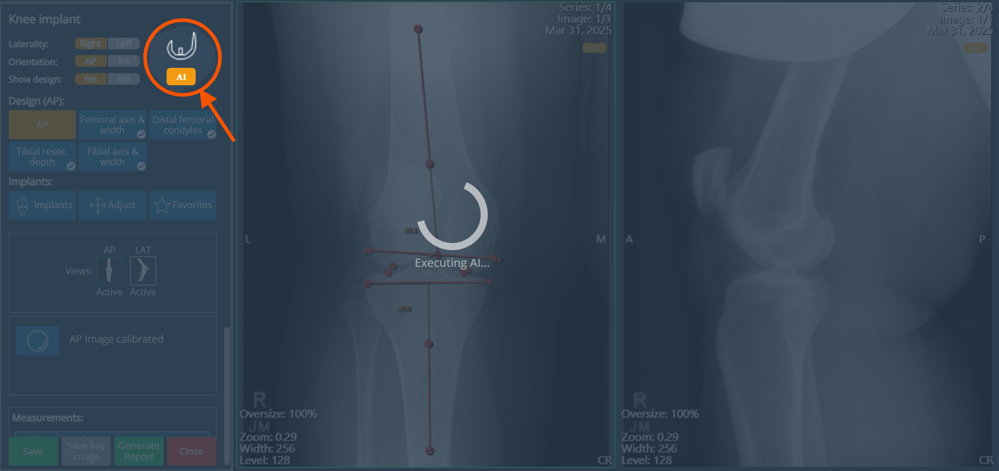

_A favorite template was suggested with the Autosizing feature_:

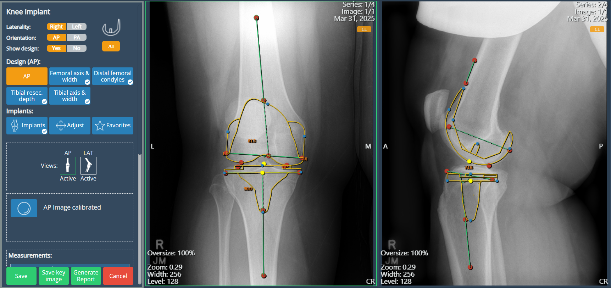

### Autosizing:

When AI Mode is executed, the Autosizing functionality will suggest an implant model from the list of saved favorites and the size that best fits the image, based on the annotations created by the AI.
For this feature to work, at least one template must be saved in the Favorites list, as the system uses these configurations to determine the most suitable option. If no favorite implants are available, only annotation design will be generated, and you can proceed manually by selecting and adjusting the appropiate implants.

## Manual Templating

Manual templating allows users to define the implant plan by following a step-by-step process. This involves drawing the required annotations directly on the image, adding the appropriate implant components, and adjusting their position using the available tools.

Before starting any manual templating process, make sure to follow these initial steps:

1. Open a knee study with the appropriate views for the procedure.

2.  Locate the tool in the interface by clicking the eFit button.

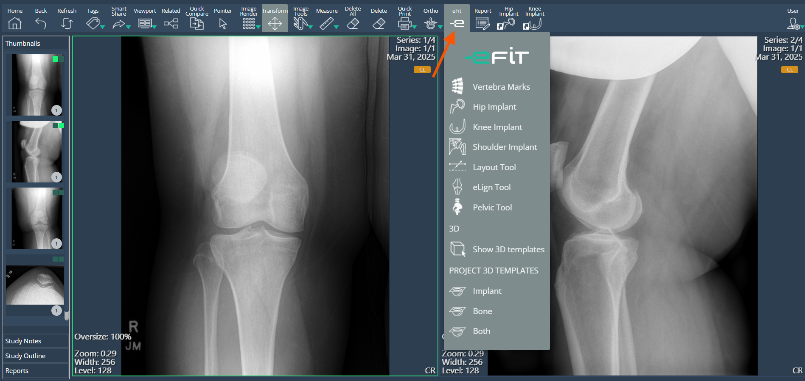
<br><br>
The following section provides a detailed, step-by-step explanation of the manual templating process.

### Knee
1. Click the Knee implant button. A small dialog will appear. 
2. After selecting the laterality, two additional buttons will be displayed: AP for the front (anterior-posterior) view and LAT for the side (lateral) view. Once you click each view button, you must select the viewport where that view is located. You can choose to work with either one view or both views, depending on the requirements of your procedure. 

    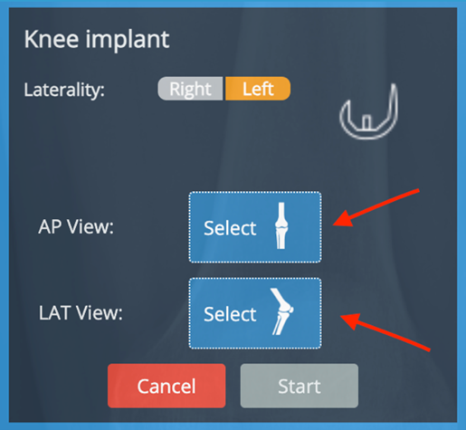

    If you initially choose to work with just one view, you can later add the other view by clicking the (+) button.

   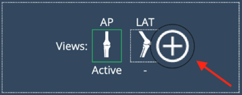

3. After selecting the views, click Start and the knee panel will automatically be displayed.

    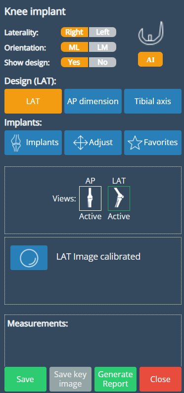


4. Calibrate the image (if not pre-calibrated). Before starting the templating process, the image must be calibrated. If the image is not calibrated, all design and implant buttons will remain disabled, and you will not be able to proceed. Check the calibration button (represented by a sphere icon) on the interface:

  - If the icon appears red, the image is not calibrated. Click the button to begin the calibration process.

  - If the icon appears blue, the image is already calibrated and you may continue with the next steps.

Now that the image is calibrated, you can begin the Design process by choosing either the AP or Lateral view as your starting point. In this example, we will begin with the AP view.

5. Click "Femoral Axis & Width" to start the annotation. Instructions will appear in the panel to guide you through the process. Once you complete the first group of points, a ✔ icon will appear, indicating that the step is finished.

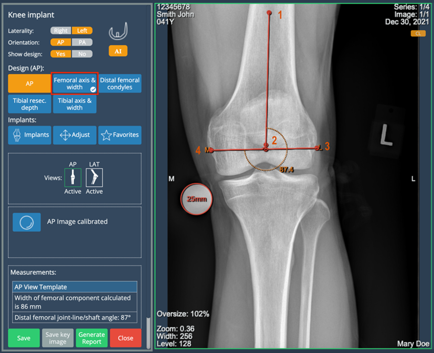
<br><br>

6. Click "Distal Femoral Condyles" and place points on the distal medial and lateral femoral condyles. These points are optional and only required if you wish to obtain the resection value.

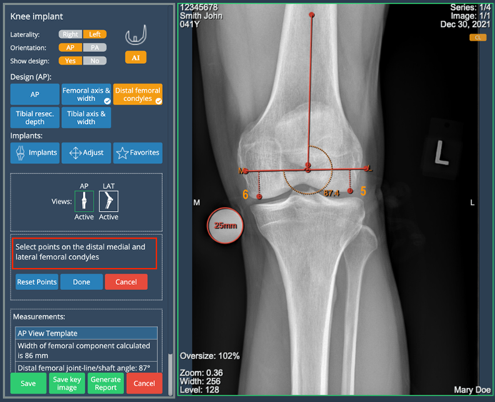
<br><br>

7. Click "Tibial Resec. Depth" and place points on the medial and lateral femoral condyles. This step is optional and only necessary if you want to calculate the resection values.

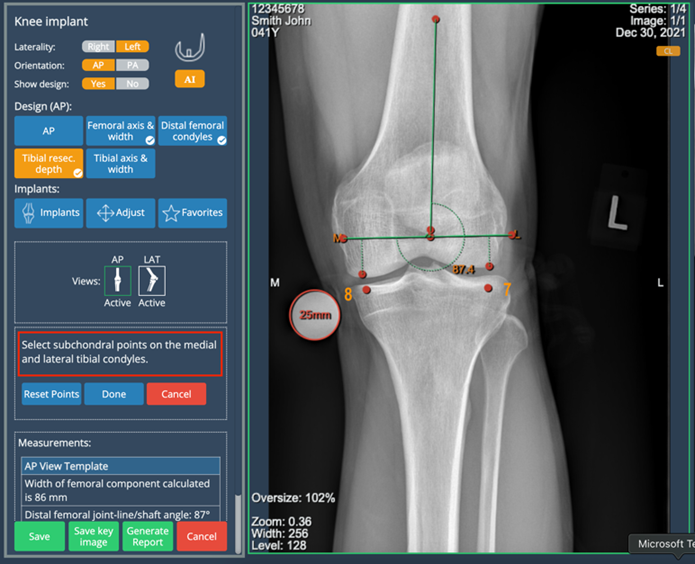
<br><br>

8. Click "Tibial Axis & Width" and follow the on-screen instructions:

   - Select a point at the center of the tibial canal.

   - Select a point at the center of the proximal tibia.

   - Then, select a point on one side of the proximal tibial width — the opposite side will be completed automatically.

   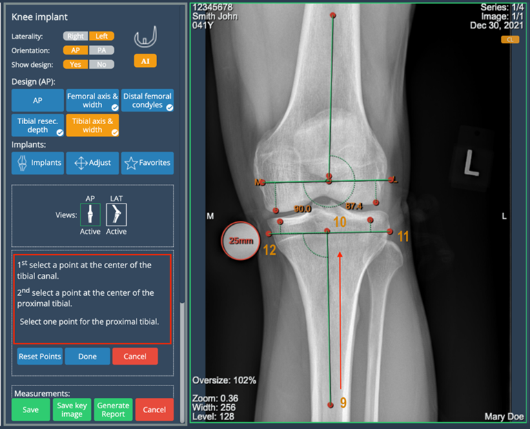
<br><br>

Once you’ve completed the annotations on the AP view, continue the Design process on the **Lateral view** by following the steps below.

9. Click "AP Dimension" and follow the guided instructions:

   - Place two points to define the Anterior Femoral Cortical Line.

   - Place one point for the Posterior Condyle Tangent — the second point will be auto-completed.

   - Select the most distal condylar point.

   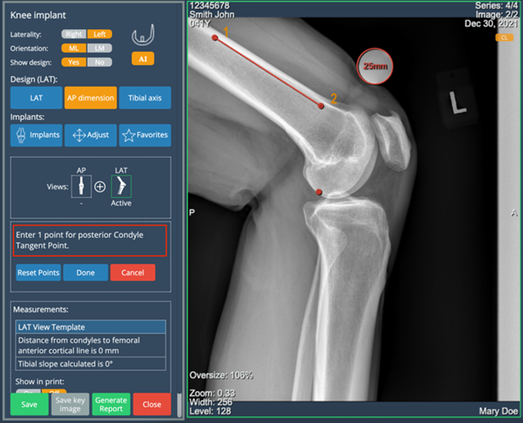

10. Once the first set of points is completed, the "Tibial Axis" button will be automatically selected, and the instructions for the next step will appear on the panel.

      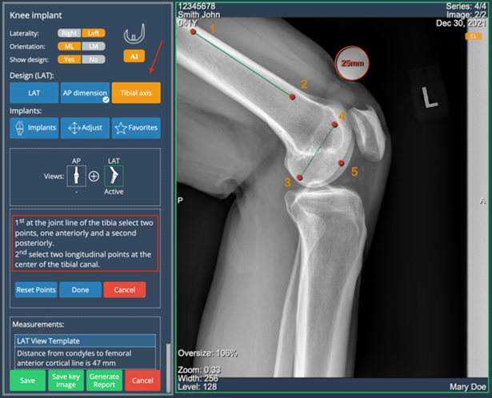
      
      You can edit individual points or drag the entire annotation as a group to adjust its position.

#### Implant Placement

The following steps describe how to **add implants** based on the anatomical landmarks defined during the design phase. However, it is important to note that users may also choose to bypass the annotation process and place implants directly on the image, after calibration. This alternative workflow may be suitable in scenarios where precise measurement is not required or when the user opts for a simplified approach for visual assessment or reference.

11. Click on the Implant button. A panel will appear where you can select the Manufacturer, Product Line, and the families for both Femoral and Tibial components. Click on each dropdown field to view and select from the available options.

      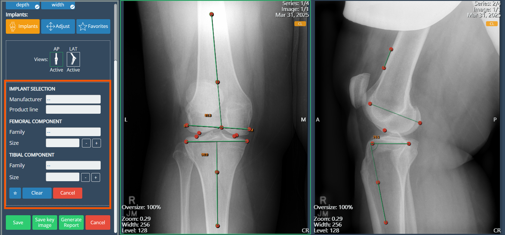

12. Adjust the implant size by clicking the Size field to display the available options, or use the (–) and (+) buttons to modify it incrementally. You can adjust the position and rotation of each component directly on the image. To reposition it, click and drag the yellow point. When selected, an orange point will appear - drag this point to rotate the implant to the desired angle. To remove the implant from the view, click the Clear button.

_Size Adjustment_
   
   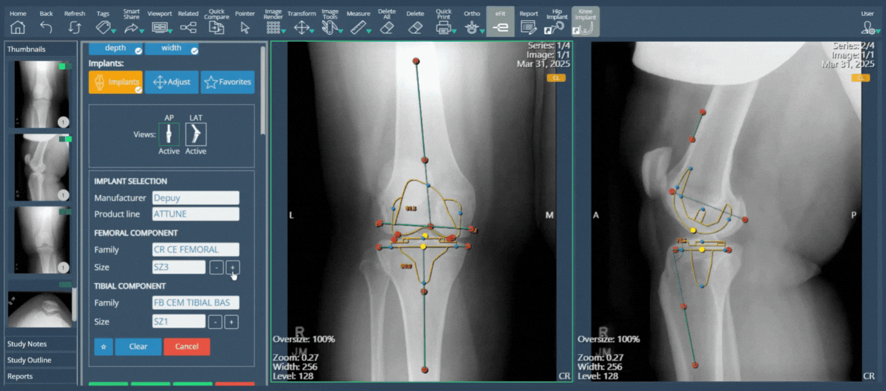

_Position and Rotation_

   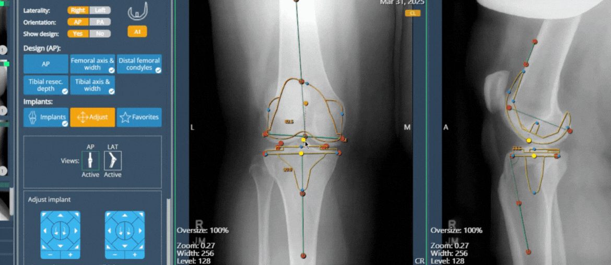
   <br><br>

 13. Final steps. Once the template has been generated, the user has the option to save the current view as a Key Image, which is particularly useful for comparing different implant models over the same image. Alternatively, the user can simply save the template without creating a Key Image.

 

 14. To create a report click the Generate Report button to open a preview. In this view, the user can review the information to be included, toggle the visibility of suggested fields, and add Key Images to the report as needed. This allows for a customizable and comprehensive summary of the planning session.

