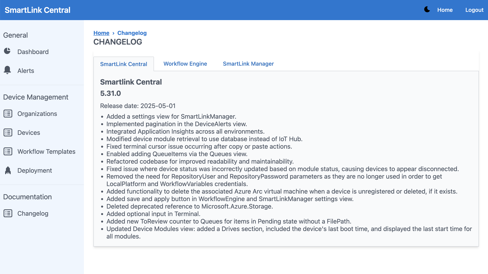
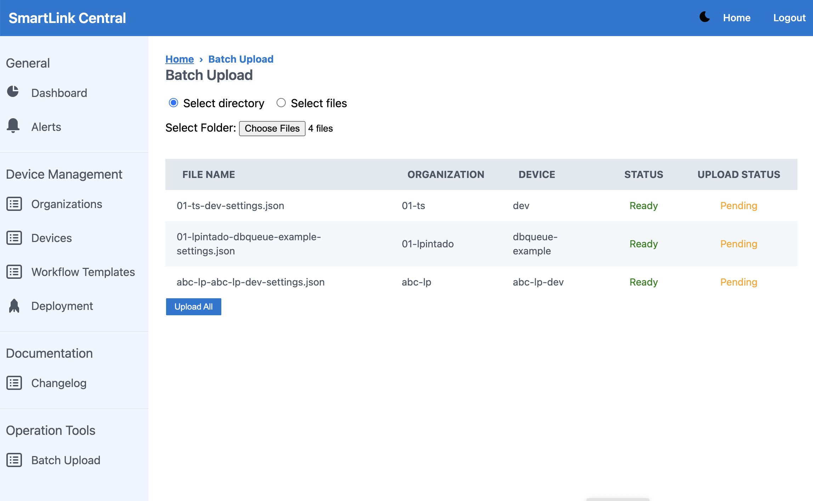
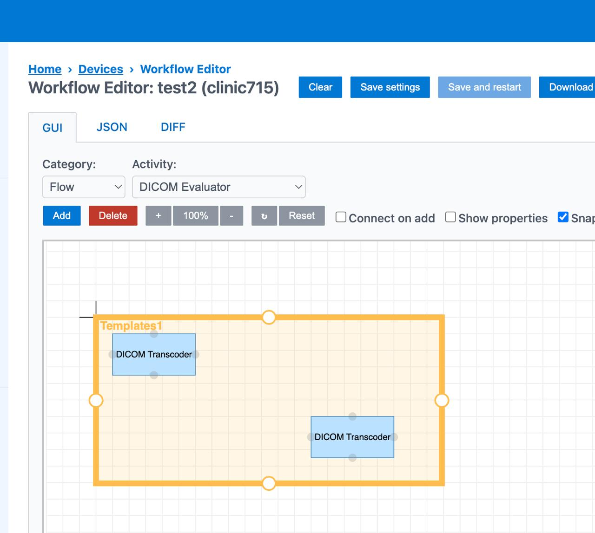
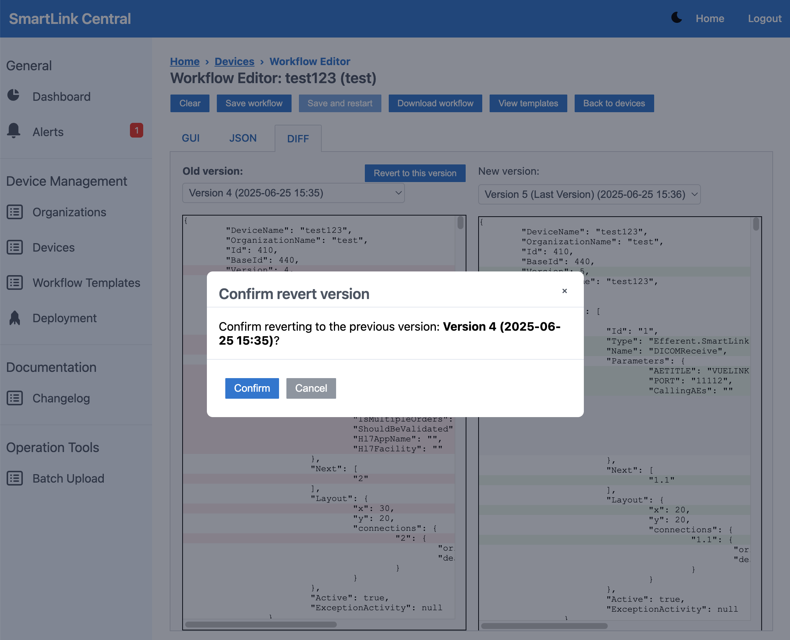
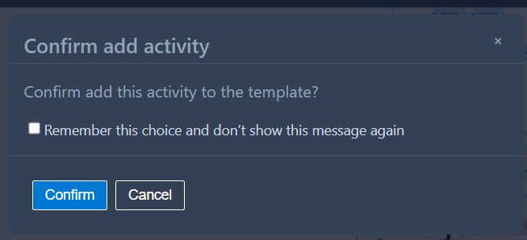
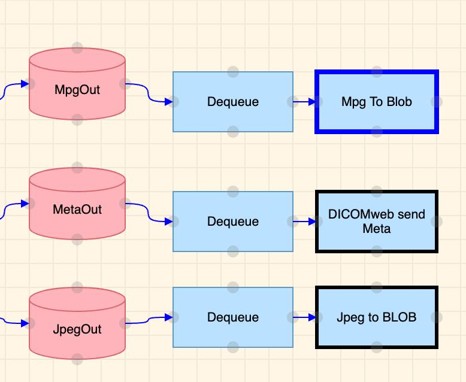

img class="logo" width="300" alt="logo" src="../../efferent_logo.png" />

<br/>

# Release Notes

```
Product Name:   Smartlink 5
Version Number: 5.33
Release Date:   June, 2025
```

## Table of Contents

1. [Introduction](#introduction)
2. [New Features](#new-features)
3. [Improvements](#improvements)
4. [Bug Fixes](#bug-fixes)
5. [Deprecations](#deprecations)
6. [Known Issues](#known-issues)
7. [Upcoming Features](#upcoming-features)

## Introduction

Welcome to the June 2025 release of Smartlink 5. This release introduces new features, usability improvements, and important bug fixes within Smartlink Central. Enhancements focus on improving user interaction, visual clarity, and overall system reliability across the workflow and template management tools.

## New Features

### Centralized Changelog View for Smartlink Modules

A new Changelog page has been implemented within Smartlink Central to provide users with a centralized and organized view of feature releases and system updates. This page is now accessible from the main navigation bar through a new item labeled "Changelog". The page features a tabbed panel structure, allowing users to switch between changelogs for different Smartlink components: Smartlink Central, Workflow Engine, Smartlink Manager, and FTP Plugin. Each tab displays entries relevant only to its respective module. Changelog entries are presented in a clear and consistent format, including the feature name, version number, release date, and a bulleted list of detailed release notes, enabling users to easily track the progress and improvements made to each component over time.



### Batch Upload View for Operation Tools

A new view named “Batch Upload” has been created under the Operation Tools section in the navigation bar. This feature enables users to upload multiple configuration files efficiently by selecting a local folder, a single file, or multiple files at once.

Once a folder is selected, the system automatically scans its contents and extracts relevant data from each .json file, including the organization name and device name. For every valid file, a summary list is displayed, showing the filename and the corresponding target device.

Before the upload is executed, users are presented with a preview list of all detected files. This list includes the file name, target organization, target device, and a validation status that clearly indicates:

- Files with an invalid filename format

- Files referencing unknown organizations or devices

Only .json files are considered, and any invalid or unrecognized entries are clearly highlighted and excluded from the upload unless corrected by the user.



## Improvements

### Enhanced navigation experience in the Smartlink Central workflow editor

The workflow editor now offers enhanced navigation features to improve user experience when working with large diagrams. Users can drag the editor and scroll freely within the canvas, making it easier to explore workflows that extend beyond the visible area. Additionally, the canvas has been optimized to adjust automatically based on the screen size, ensuring an optimal viewing experience across devices. It has also been configured to always display at least 10% of the workflow within view, preventing users from losing track of the diagram.

Moreover, it is now possible to select and reposition a specific section—or the entire diagram—by holding Shift + Click and dragging the mouse over the desired area. This allows users to move all selected elements together within the canvas, enabling faster layout adjustments and better diagram organization.

### Intuitive Real-Time Resizing for Editable Regions

Editable regions, which can be created through the “View Template” option under “Default Templates” or “Org. Templates,” now support intuitive real-time resizing. Users can adjust these regions using draggable circular handles on all four sides — top, bottom, left, and right. Each handle allows resizing along a specific axis, with immediate visual feedback through responsive cursor changes. To maintain layout integrity, resizing is constrained by surrounding elements, preventing overlaps or out-of-bounds adjustments.



### “Revert to Selected Version” option in Diff Section

A new “Revert to Selected Version” functionality has been added to the Diff section of the Workflow Editor, enabling users to quickly restore a previously selected version of a workflow with confidence and clarity.

The feature introduces a dedicated button next to the “Old Version” label. When clicked, a confirmation dialog appears, prompting the user to confirm the action (e.g., “Confirm reverting to the previous version: Version 4 (2025-06-25 15:35)?”). This ensures that the action is only performed with clear user intent.

Once confirmed, the system replaces the currently active workflow with the selected older version, preserving all elements of the workflow state — including shapes, properties, and metadata. After the revert, the user is automatically redirected to the GUI view, where the restored version is displayed for immediate inspection.



### Shape Inclusion/Exclusion Confirmation in Template Regions

A new feature has been implemented in the Workflow Editor to enhance control and transparency when modifying the contents of template regions. Users are now prompted with a confirmation dialog whenever an activity (shape) is either added to or removed from a template region.

Users can choose to Confirm or Cancel the action. If confirmed, the system adds the shape’s reference to either the AddedActivities or RemovedActivities array of the corresponding template, depending on whether it was included or removed, and keeps the shape in its new position to visually reflect the updated state. If canceled, the shape reverts to its original position.



### Visual Indicator for Final Tasks in Workflow

A visual enhancement has been added to highlight activity shapes that contain the IsFinalTask property. These shapes will now display a black border, making them easier to identify within the workflow and providing clearer visual cues about their role as final tasks.



## Bug Fixes

- **File with Same Name did not Reload**: Uploading a file with the same name (e.g., X.json over X.json) didn’t trigger any action, even if the file content had changed. The system failed to detect updates unless a different file was uploaded first, after which the original file could be re-uploaded successfully.

- **Copy and Delete Options Didn’t Work Inside Inserted Templates**: The Copy and Delete options in the context menu didn’t function when used within an inserted template in the editor.

## Deprecations

None

## Known Issues

None

## Upcoming Features

None

---

Thank you for being a valued user of Efferent. We hope these updates enhance your experience. For any questions or feedback, please contact our support team at support@efferenthealth.com .