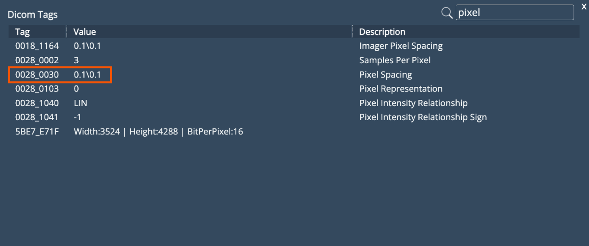
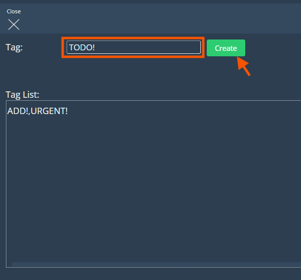
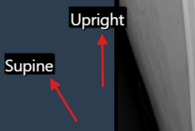
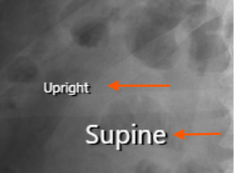
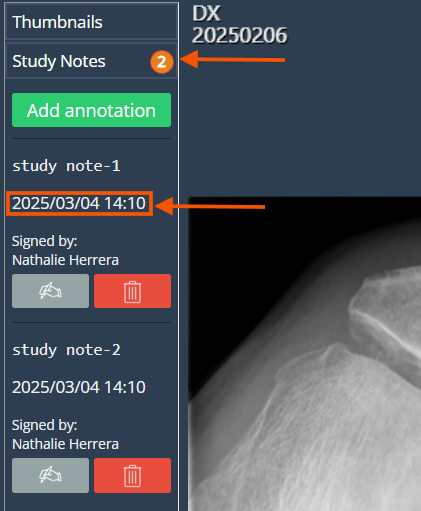
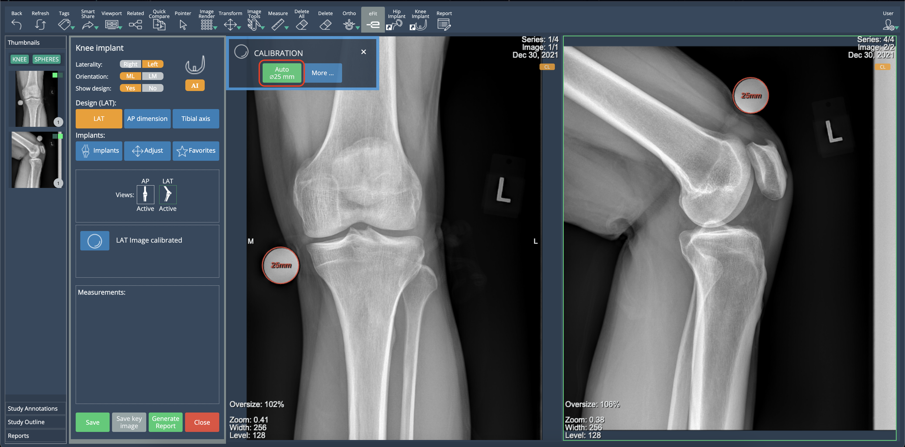
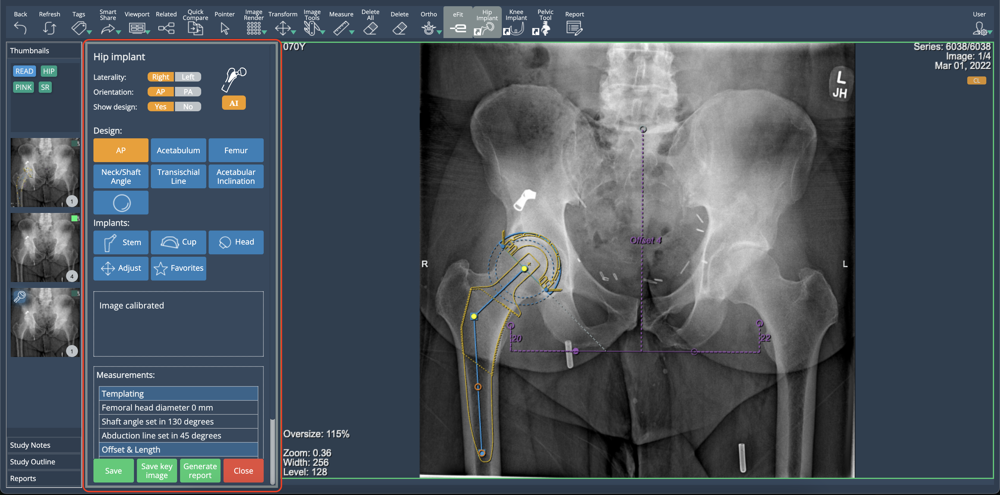
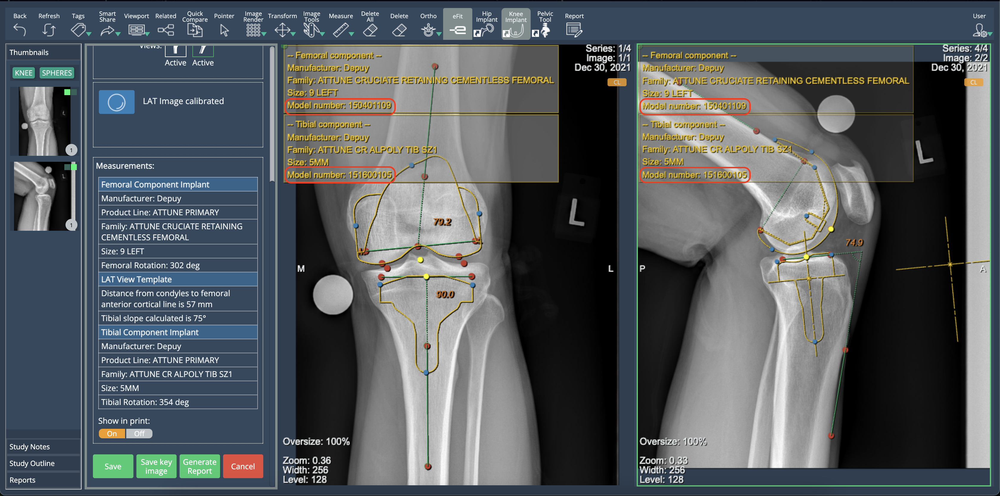
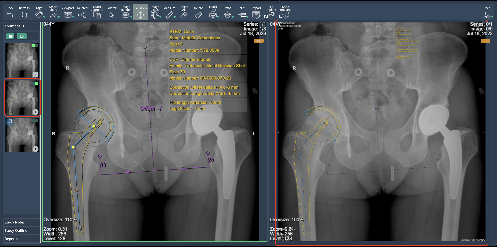
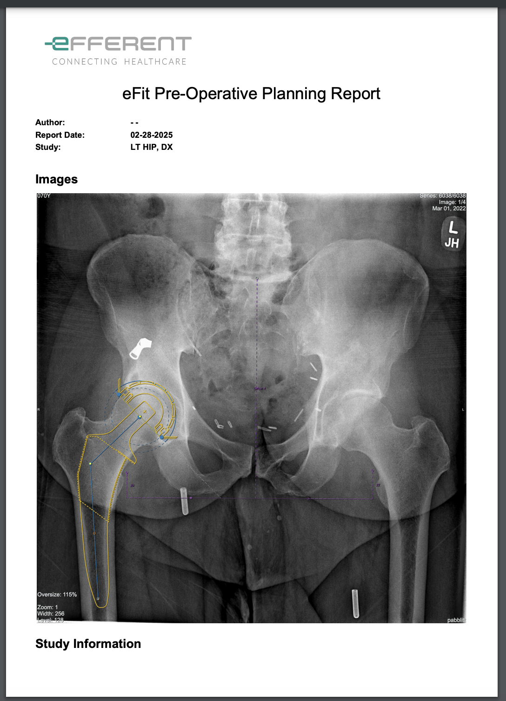

<br/>

# Release Notes

```
Product Name:   eVue and eFit
Version Number: 5.29
Release Date:   February, 2025
```

## Table of Contents

1. [Introduction](#introduction)
2. [New Features](#new-features)
3. [Improvements](#improvements)
4. [Bug Fixes](#bug-fixes)
5. [Deprecations](#deprecations)
6. [Known Issues](#known-issues)
7. [Upcoming Features](#upcoming-features)

## Introduction

Welcome to the February 2025 release of Efferent eVue and eFit. This update brings key enhancements to optimize user experience, along with important bug fixes to improve stability.

## New Features

None

## Improvements

### Image Calibration Enhancement

Previously, images uploaded to the platform were not calibrated by default. With this update, the system now extracts the Pixel Spacing value from the DICOM tag to apply a calibration factor, ensuring that images are uploaded with the correct scale.



### Improved Tag Highlighting for Urgent Records

Tagging urgent records is now easier and more intuitive. Instead of checking a "Highlighted" box during tag creation, simply add an exclamation mark (!) at the end of the tag. This will automatically highlight it in red, ensuring urgent items stand out at a glance.



### Enhanced Marker Annotations

Previously, Marker annotations appeared with a black background when added to the DICOM image. With this update, the black background has been removed, ensuring a cleaner and more seamless display.

Before:



After:



### Study Notes

The "Study Annotations" feature has been renamed to "Study Notes" and remains located below the Thumbnails dropdown tab. This update introduces a timestamp displaying the date and time when a note is signed, along with a note counter in the tab for better tracking and organization.



### Improved Auto-Calibration for Knee Templates

Auto-calibration now applies to both knee views simultaneously, improving efficiency and reducing manual steps. Previously, users had to run the auto-calibration separately for each view. With this update, the process is executed for both views at once, streamlining workflow.



### Saved Docked Window Position

eFit now remembers its last window position for a smoother experience. Previously, the pop-up window always appeared floating, requiring users to dock it manually. Now, it stays docked or floating as last set when reopening the study, improving efficiency.



### Implant Model Display in eFit

eFit now provides visibility of implant model information. When templating a hip or knee, the implant model number is displayed in the property list of each component. This information is available in the table shown when selecting "Show in Print", ensuring users have quick access to implant details.



### New DICOM image generation in eFit

eFit now creates a new DICOM image in a separate series when saving a template. This image contains the implant planning information for hip and knee templates, ensuring compatibility with external DICOM viewers.



### Template Image Integration in eFit Reports
eFit reports now display images of the generated hip and knee templates. Previously, reports did not support image visualization. With this update, template images are automatically included, improving documentation and clarity.



## Bug Fixes

- **SmartShare by Username Not Functional**: User suggestions did not appear when typing a username, preventing SmartShare via this method.

- **SmartShare via QR Code Not Working**: The report containing the QR code was not generated correctly.

- **Search button became disabled**: Search button became disabled after clicking the pin button.

## Deprecations

None

## Known Issues

None

## Upcoming Features

None

---

Thank you for being a valued user of Efferent. We hope these updates enhance your experience. For any questions or feedback, please contact our support team at support@efferenthealth.com .