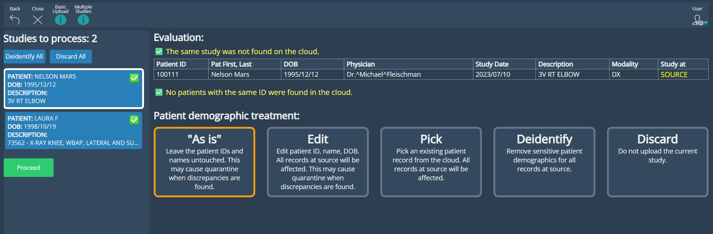
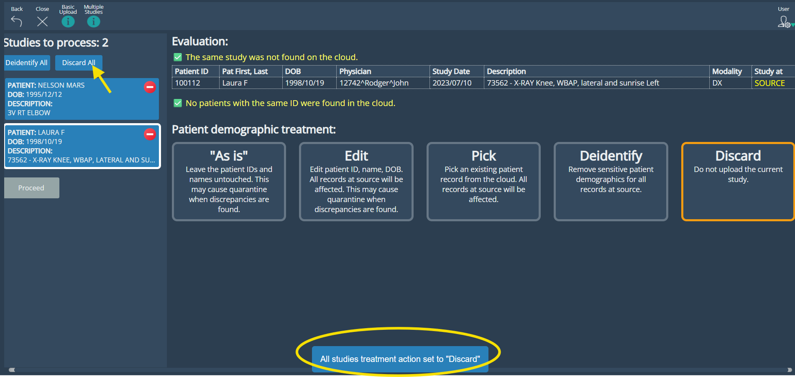
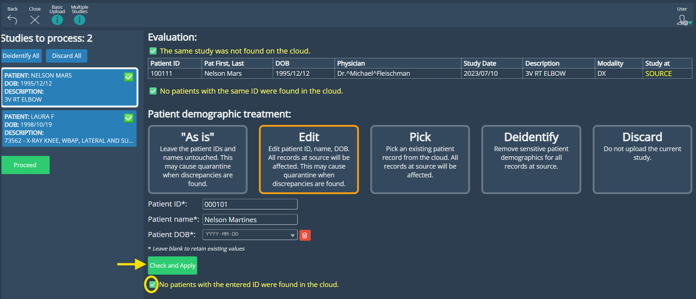
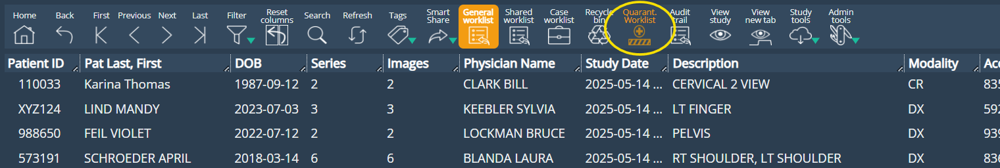
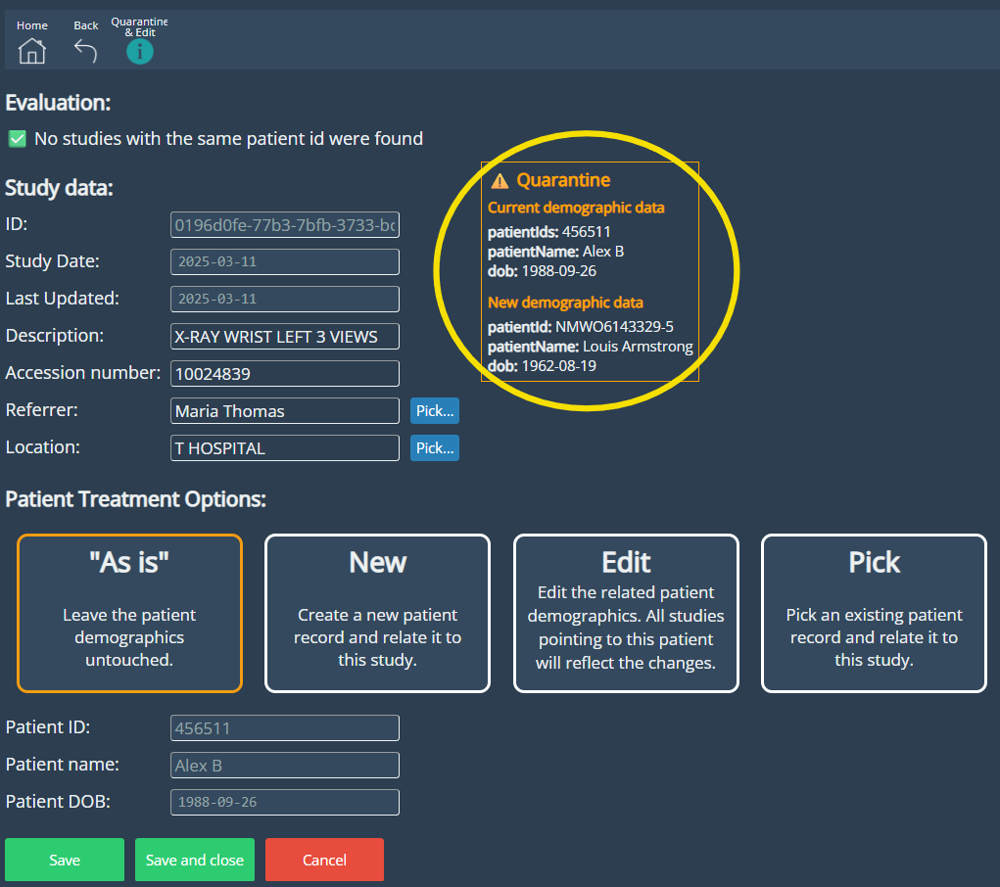
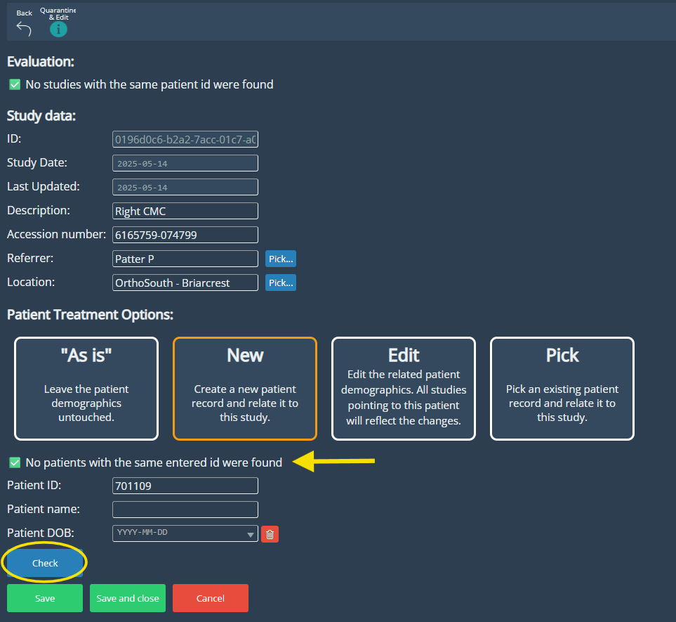
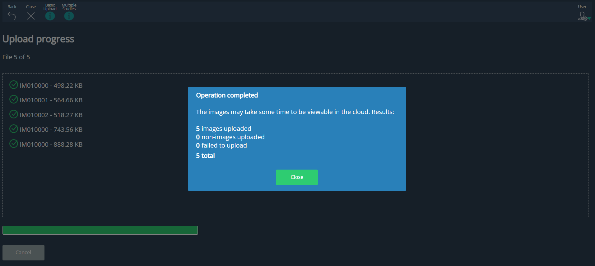

<br/>

# Release Notes

```
Product Name:   eVue and eFit
Version Number: 5.32
Release Date:   May, 2025
```

## Table of Contents

1. [Introduction](#introduction)
2. [New Features](#new-features)
3. [Improvements](#improvements)
4. [Bug Fixes](#bug-fixes)
5. [Deprecations](#deprecations)
6. [Known Issues](#known-issues)
7. [Upcoming Features](#upcoming-features)

## Introduction

Welcome to the May 2025 release of Efferent eVue and eFit. This update introduces new and anticipated features designed to significantly enhance efficiency and usability. It also includes key enhancements and critical bug fixes to ensure a smoother, more reliable user experience.

## New Features

### SmartUpload

We are introducing a redesigned Upload experience in eVue, built to improve data accuracy, visibility, and control when uploading studies to the platform. This release brings a more intuitive layout, enhanced evaluation feedback, and smarter workflows for handling studies.

•	**UI Improvements:** A redesigned interface that delivers a clearer, more efficient experience for managing studies. Each study is now presented as a selectable box, with detailed demographic and study data displayed clearly in structured tables upon selection, optimizing space and clarity. Users can apply actions such as AS IS, Edit, Pick, Deidentify, or Discard to individual studies, or perform bulk operations like Deidentify or Discard All. 

**AS IS**: Upload the study with its original data.

**EDIT**: Modify patient demographics before upload.

**PICK**: Link the study to an existing patient in the system.

**DEIDENTIFY**: Anonymize the study before uploading.

**DISCARD**: Exclude a study from the upload.


• **Pre-Upload evaluation**: The system automatically evaluates each study after scanning, displaying contextual inline notifications above the data tables. These alerts include intuitive icons that signal issues like demographic discrepancies or potential duplicates, giving users immediate feedback before uploading.


_SmartUpload: AS IS option selected_



<br>

_SmartUpload: Bulk action selected_



<br>

• **Pre-Upload evaluation**: The system automatically evaluates each study after scanning, displaying contextual inline notifications above the data tables. These alerts include intuitive icons that signal issues like demographic discrepancies or potential duplicates, giving users immediate feedback before uploading.

• **Enhanced Edit:** The Edit feature within the Upload process has been enhanced to allow selective field updates and to apply changes across all instances of the same patient when applicable.

_SmartUpload: EDIT option_



<br>

**• Discrepancy Quarantine feature:** If a user proceeds to upload a study despite system warnings indicating that the same study already exists in the cloud with differing demographic data, the platform will automatically redirect the existing version to the quarantine worklist. All users can view studies in the quarantine list, but only those with admin roles can take further actions—such as editing the study’s demographics through Admin Tools > Edit Study or confirming it as-is before restoring it to the worklist. When a study is sent to quarantine, the Quarantine Worklist button in the interface turns orange, visually signaling the presence of unresolved items. 

_Quarantine Worklist button_



<br>

_Quarantined study editing_



### Edit Study
Users can easily update study details and choose how to handle patient data using options like As Is, New, Edit, or Pick. The improved interface simplifies the process with a clearer layout and responsive guidance. When creating or editing a patient, the system automatically checks for existing records based on the entered Patient ID and notifies the user if a match is found, helping maintain data consistency and avoid duplicates.



## Improvements

### Non-image instances support
The Upload system now supports the processing and storage of non-image DICOM instances—such as KO, PR (without pixel data), RT, and REP, were previously not handled and therefore excluded from uploads. Although these instances are not currently viewable in eVue, they are now successfully uploaded and stored in the cloud. This ensures that no part of the original DICOM dataset is lost.

### Upload summary
After completing an upload, users receive a detailed summary report on screen. This report includes the number of image instances successfully processed, any failures, and total count of non-image instances.



### eFit instructions improvements
In the eFit panel, some instructions have been clarified to better guide users during template creation

### Navigation enhancement
Navigation behavior has been refined—after viewing a study, users are now returned to the same page in the worklist they were previously on, maintaining context.

## Bug Fixes

- **Studies shared via QR code opened in High-Res mode by default**: When scanning studies shared via QR, they were automatically converted to HD.
- **Context menu event did not work on input text form elements:** The context menu with options like copy and paste would not appear when right-clicking on any text input field.


## Deprecations

None

## Known Issues

None

## Upcoming Features

None


---

Thank you for being a valued user of Efferent. We hope these updates enhance your experience. For any questions or feedback, please contact our support team at support@efferenthealth.com .