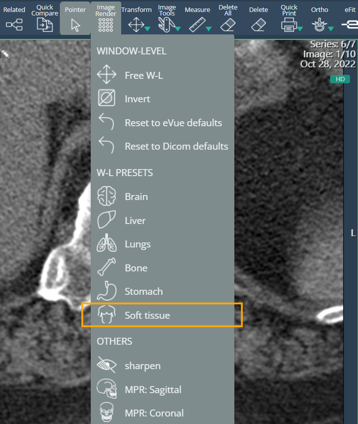

<br/>

# Release Notes

```
Product Name:   eVue and eFit
Version Number: 5.33
Release Date:   June, 2025
```

## Table of Contents

1. [Introduction](#introduction)
2. [Improvements](#improvements)
3. [Bug Fixes](#bug-fixes)
4. [Deprecations](#deprecations)
5. [Known Issues](#known-issues)
6. [Upcoming Features](#upcoming-features)

## Introduction

Welcome to the June 2025 release of Efferent eVue and eFit. This update brings overall stability improvements and minor bug fixes to enhance consistency and usability. While no new features are included this time, the refinements made help ensure a more reliable experience.

## Improvements

### New Soft Tissue W-L Preset
A new recommended window level (W-L) preset for soft tissue images has been added. Like other organ-specific presets, it is available in the Image Render menu when images are viewed in HD mode, providing optimized visualization for soft tissue structures.



### Improved Patient Data Validation in Upload
The data evaluation criteria in the EDIT section of the Upload module have been refined. The system no longer treats commas as a differentiating factor and now detects similarities in patient data with greater accuracy. This reduces false inconsistencies and prevents studies from being unnecessarily sent to quarantine when the uploaded studies already exist in the system.

### Performance Improvement: Caching for Multiframe Studies
Implemented a caching mechanism to store frames from multiframe studies — especially those that are large and resource-intensive — to improve loading speed and overall viewer performance.

### Support for PDF DICOM Files
eVue now supports non-image PDF DICOM files without errors. When a PDF is present instead of an image:

- An icon labeled "PDF" is displayed

- Opening the PDF launches it in a new browser window.

## Bug Fixes

- **Images Failing to Load on Safari (iPad)**: Resolved an issue where studies would fail to load images when accessed via Safari on iPads running the latest iOS version. Images now display correctly across all supported devices and browsers.
- **Quarantine Info Box Displayed in Incorrect View:** Fixed an issue where the informative box for Quarantine appeared in the wrong view (Inspect). It now displays only in the appropriate context during the Edit process for quarantined studies.
- **Progress Bar Not Reaching 100% on Scan Completion**: Resolved an issue where the progress bar would not reach 100% at the end of the scanning process when images with errors were present. The bar now correctly reflects completion status, including errored images.


## Deprecations

None

## Known Issues

None

## Upcoming Features

None


---

Thank you for being a valued user of Efferent. We hope these updates enhance your experience. For any questions or feedback, please contact our support team at support@efferenthealth.com .