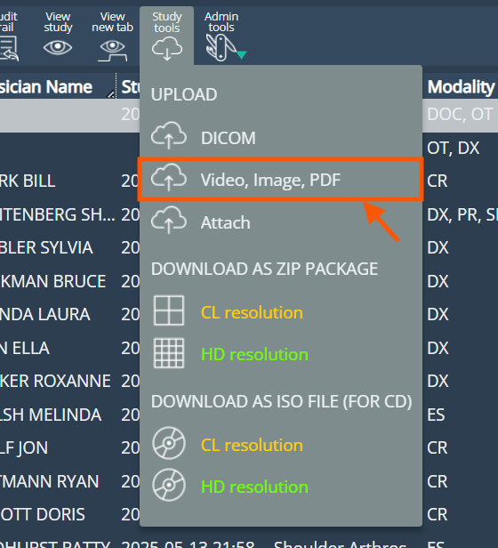
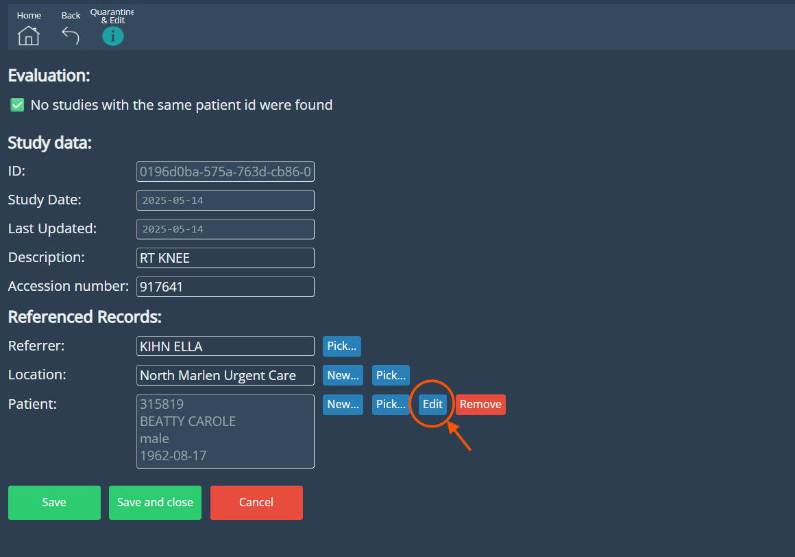
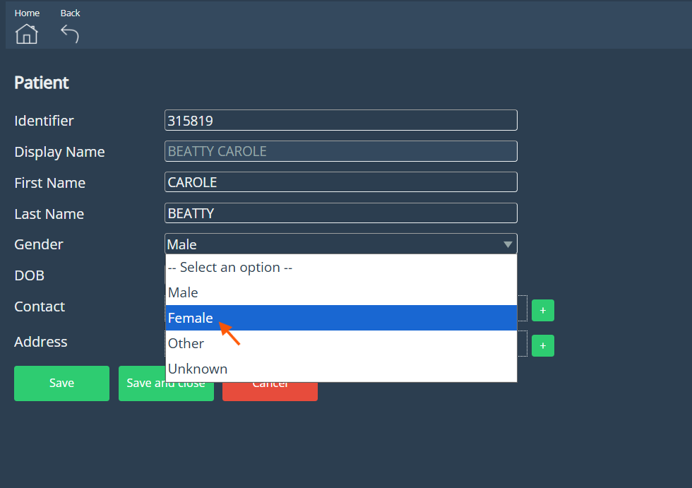
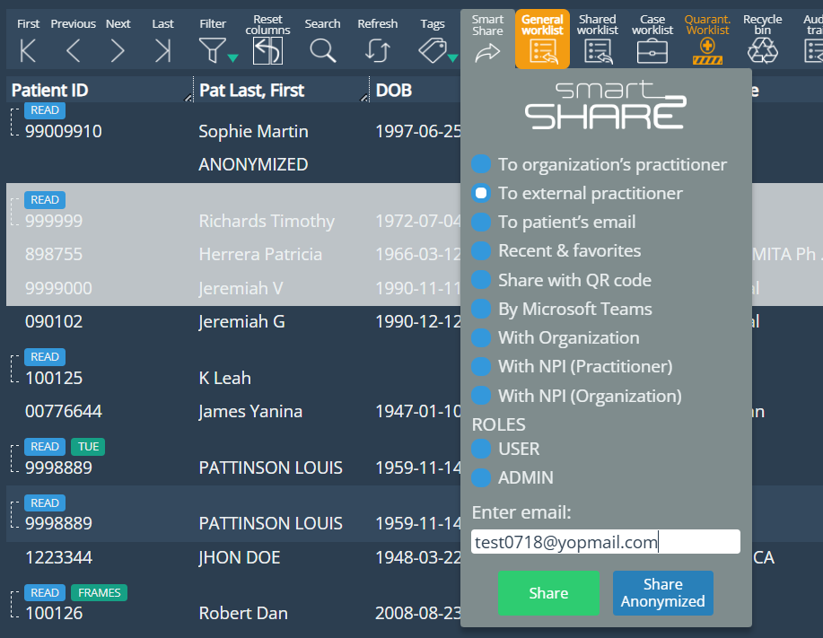
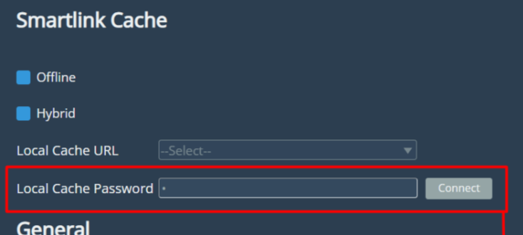
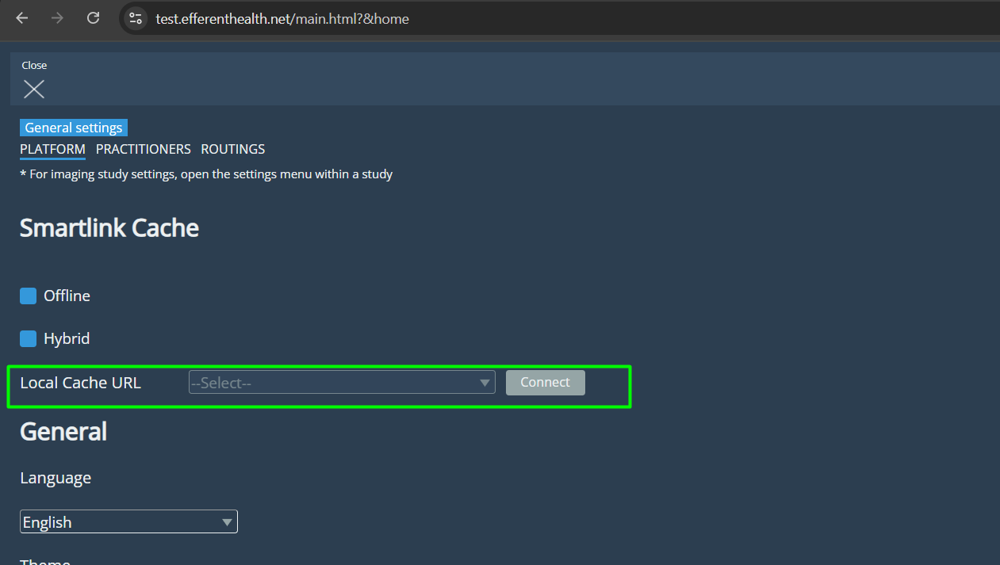
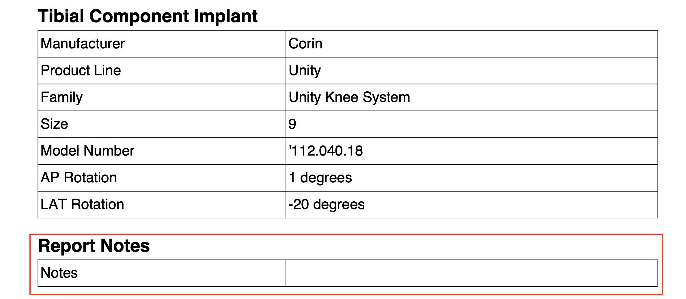

<br/>

# Release Notes

```
Product Name:   eVue and eFit
Version Number: 5.34
Release Date:   July, 2025
```

## Table of Contents

1. [Introduction](#introduction)
2. [New Features](#new-features)
3. [Improvements](#improvements)
4. [Bug Fixes](#bug-fixes)
5. [Deprecations](#deprecations)
6. [Known Issues](#known-issues)
7. [Upcoming Features](#upcoming-features)

## Introduction

Welcome to the July 2025 release of Efferent eVue and eFit. This release introduces functional improvements and bug fixes aimed at optimizing performance and enhancing the user experience across key workflows. 

## New features

### Upload Feature Now Supports PDFs and Image Files

The upload functionality has been extended to support additional file types, including PDF and image files (JPEG, JPG). Previously, only DICOM and video files were supported. When uploading these new file types, users are required to manually provide key patient information—such as Patient ID, Name, and Date of Birth—in order to generate the study record and enable visualization of the uploaded content.



Unlike the Attach feature, the PDF files are uploaded here as embedded PDFs, and not converted into images (one per page). This means eVue will show the whole document as a clickable PDF icon.

## Improvements

### Improvement in the Edit Study page

The Edit Study page has been enhanced to offer a more intuitive and visually organized experience. The updated layout provides a cleaner, more structured design, making it easier for users to access and edit study information. Additionally, the interface now supports the editing of all necessary fields for resources, streamlining the process and improving overall usability.





### Multi-study Sharing via SmartShare
SmartShare now supports selecting and sending multiple studies in a single email. Previously, only one study could be shared at a time. This enhancement streamlines the sharing process, especially when multiple studies need to be reviewed together. 



### Password field removed for Local Cache access
The password field previously required to connect to the Local Cache from Platform has been removed. This change was made possible by recent SL5 updates, which enable direct access using an improved authentication method, eliminating the need for manual password entry.

_Before:_



_After:_



### Notes Field in eFit Report
Added a new “Notes” field to the eFit report. The content for this field is sourced from the Study Notes entered in the viewer, found at the bottom of the thumbnails section.



## Bug Fixes

- **Image skipping during series navigation**:Resolved an issue where some images were being skipped when navigating through image series—either by scrolling or using keyboard arrows. This fix ensures smooth and complete navigation across all images, improving the user experience when reviewing multi-image series.
- **Missing Secondary Captures in Report for New Studies** When generating a report for a study without previously generated key images or secondary captures, the newly created Secondary Capture images are not included in the downloaded report as expected.
- **Incorrect Annotation Laterality in PA Projections**: Resolved an issue where AI-generated annotations appeared on the wrong side when processing studies with a PA projection. Now, annotations correctly align with the selected laterality.
- **Stitching Allowed for Non-Visual resources**: The system incorrectly allowed stitching operations on studies with modality SR (Structured Report) or DOC (Document), despite these not containing visualizable images.

## Deprecations

## Known Issues

- **Save required before editing patient information**: Currently, in the Edit Study page, any changes made study fields must be saved before opening the Edit Patient form. This is being reviewed for resolution in a future update.

## Upcoming Features

None

---

Thank you for being a valued user of Efferent. We hope these updates enhance your experience. For any questions or feedback, please contact our support team at support@efferenthealth.com .