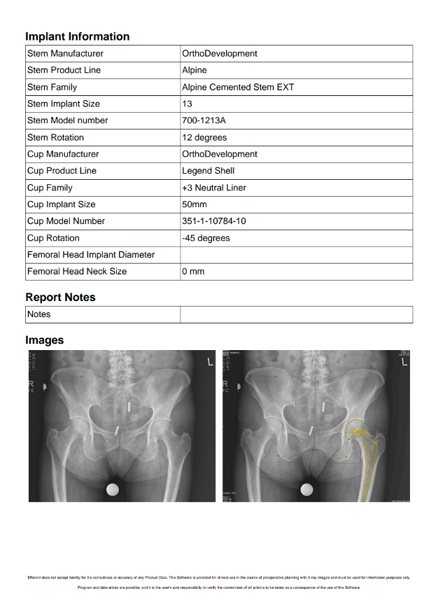

<br/>

# Release Notes

```
Product Name:   eVue and eFit
Version Number: 5.35
Release Date:   August, 2025
```

## Table of Contents

1. [Introduction](#introduction)
2. [Improvements](#improvements)
3. [Bug Fixes](#bug-fixes)
4. [Deprecations](#deprecations)
5. [Known Issues](#known-issues)
6. [Upcoming Features](#upcoming-features)

## Introduction

Welcome to the August 2025 release of Efferent eVue and eFit. This release focuses on delivering key enhancements and functional improvements aimed at optimizing performance and elevating the user experience across core workflows.

## Improvements

### eFit report improvement

Improvements have been made to the structure of the eFit reports. These updates include a reorganization of the report fields and changes to the layout of the graphical section. Previously, a single large image was displayed at the beginning of the report. It has now been moved to the end of the report and replaced with two images: one showing the study without the implant and another showing the study with the implant.

_Before:_


_After:_




### eFit autosizing enhancement

Optimized the autosizing algorithm for HIP and Knee measurements to deliver faster results and provide more accurate size suggestions.

### Optimization in CINE

We have optimized the performance of multi-frame series visualization in the Cine tool. This improvement will be especially noticeable when viewing studies containing a large number of images. For the best experience, we still recommend using hardware with high processing capacity.

## Bug Fixes

None

## Deprecations

None

## Known Issues

None

## Upcoming Features

None

---

Thank you for being a valued user of Efferent. We hope these updates enhance your experience. For any questions or feedback, please contact our support team at support@efferenthealth.com .