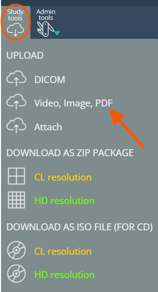
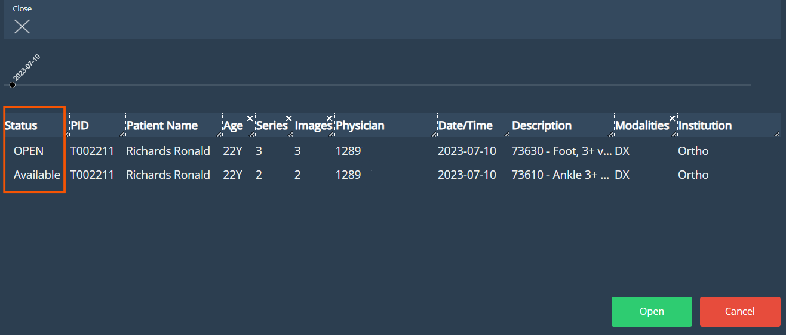

<br/>

# Release Notes

```
Product Name:   eVue and eFit
Version Number: 5.36
Release Date:   September, 2025
```

## Table of Contents

1. [Introduction](#introduction)
2. [Improvements](#improvements)
3. [Bug Fixes](#bug-fixes)
4. [Deprecations](#deprecations)
5. [Known Issues](#known-issues)
6. [Upcoming Features](#upcoming-features)

## Introduction

Welcome to the September 2025 release of Efferent eVue and eFit. This update includes key enhancements, functional improvements, and critical fixes to optimize performance and deliver a smoother user experience across core workflows.

## Improvements

### Support for PNG Image Uploads

The upload tool now supports PNG image files in addition to PDF and JPEG formats, with the ability to select and upload multiple files at once. This enhancement provides greater flexibility when attaching supplementary images to studies.



### Unified Related Worklist for General and Quarantine Studies

The Related Worklist now displays all studies for a patient, regardless of whether they are stored in the General or Quarantine Worklist. A new Status column has been added to clearly indicate each study’s state (e.g., Available, Archive, Quarantine, OPEN), and the system now provides a notification when no related studies are found. This improvement ensures a unified view of patient studies, reduces the need to switch between worklists, and makes it easier to track the current status of each study.



### Performance Optimization for Large Multiframe Studies

Memory management has been optimized for heavy multiframe studies, improving overall performance and stability of the application, particularly on machines with limited resources.

### Performance Optimization for Filters

Across the week, it may be noticeable a gradual increase of performance when applying filters in worklists. That may also have an impact in other operations like uploads and study viewing.

## Bug Fixes

- **PR Studies Not Displaying When Recall Last Display Mode is Set to Tile**: Resolved an issue where enabling the “Recall last display mode” option with Tile mode as the saved state caused PR studies to fail to display images in the viewport.

- **General Filters Displayed in Personal Filters List**: Resolved an issue where newly created general filters appeared under the creator’s personal filters list, despite being correctly visible to all users in the organization. General filters now display in the general filters list as intended.

- **Image Distortion in Multiframe Series at Scroll Limits**: Resolved an issue where scrolling through a multiframe series caused images to become distorted when reaching the upper or lower index limits.

- **Attached Images Not Displaying in Video Studies**: Resolved an issue where images attached to video studies (MP4) remained stuck in a loading state and did not display in the thumbnail. Attached images now load correctly.

## Deprecations

None

## Known Issues

None

## Upcoming Features

None

---

Thank you for being a valued user of Efferent. We hope these updates enhance your experience. For any questions or feedback, please contact our support team at support@efferenthealth.com .