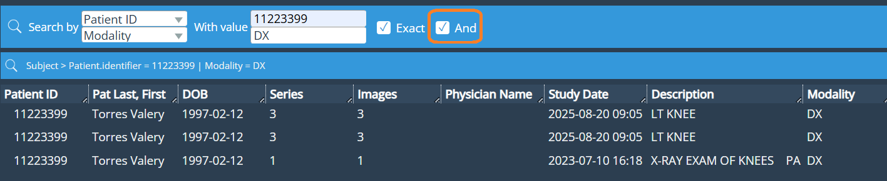
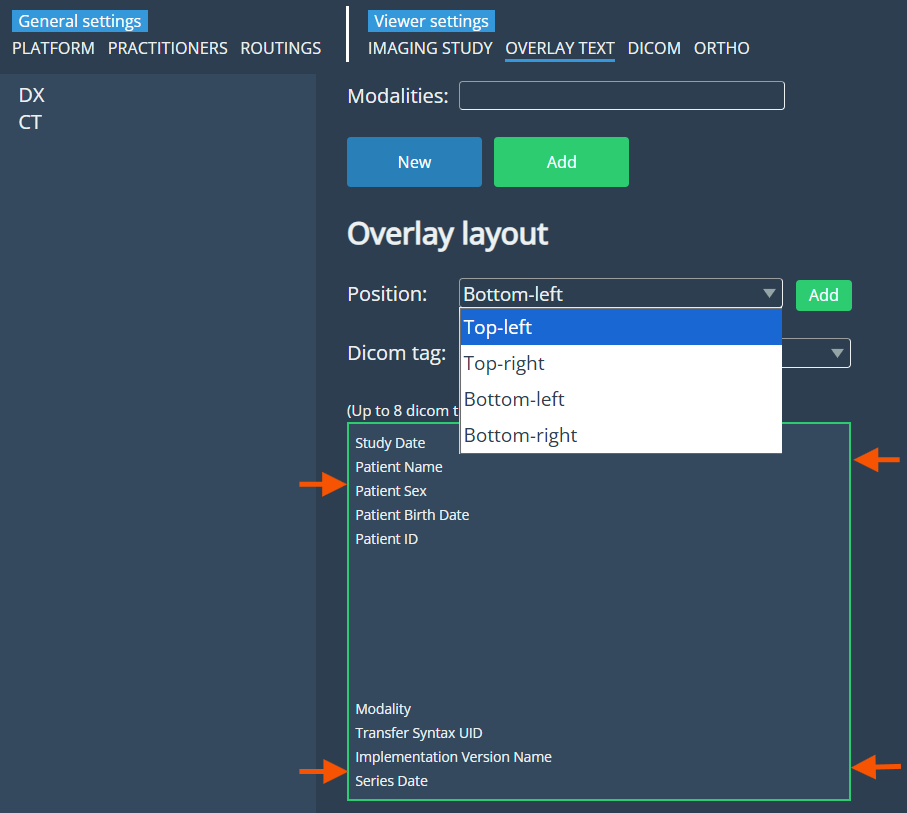
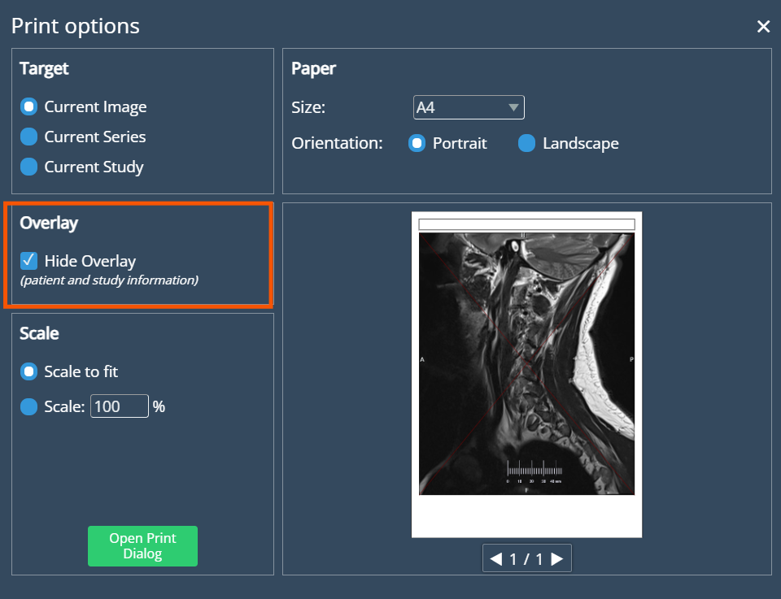
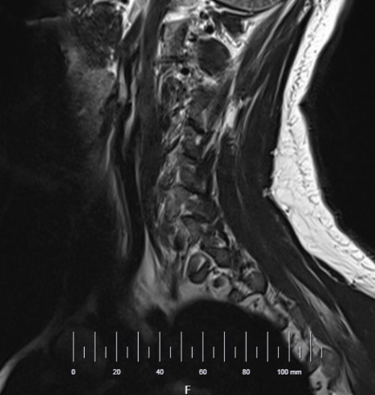

<br/>

# Release Notes

```
Product Name:   eVue
Version Number: 5.37
Release Date: October, 2025
```

## Table of Contents

1. [Introduction](#introduction)
2. [Improvements](#improvements)
3. [Bug Fixes](#bug-fixes)
4. [Deprecations](#deprecations)
5. [Known Issues](#known-issues)
6. [Upcoming Features](#upcoming-features)

## Introduction

Welcome to the October 2025 release of Efferent eVue. This release focuses on enhancing functionality, refining usability, and addressing key issues to improve system stability and ensuring a more seamless experience throughout the platform.

## Improvements

### Dual Search Functionality

A new dual-search capability has been implemented in the search bar. Users can now search using two independent fields, with the option to leave the second field empty. This improves flexibility when searching for studies or patients.



### Enhanced Patient Matching in Upload DICOM

The patient detection feature in the Upload DICOM view has been enhanced to support dual matching criteria. The system now identifies related patients by both Patient ID and Name + Date of Birth (DOB), displaying results in two separated lists. Duplicate entries are prevented, ensuring accurate and transparent patient matching.

### Overlay Text Expansion

The overlay text feature has been enhanced to support all four corners of the viewport, allowing up to eight lines per corner. This provides more flexibility for displaying important information without cluttering the image.



### Quick Print – Overlay Visibility Option

A new checkbox has been added to Quick Print settings, allowing users to hide overlay text when printing. This gives users control over the amount of detail shown in printed outputs.



### Master Patient Directory

All Patient resources have been reimported with updated PIDs, ensuring that only current and valid identifiers are maintained. Legacy or outdated PIDs have been excluded to improve data consistency across organizations.

### Unified Worklist for OSM Organizations

A unified worklist view has been implemented for OSM organizations, replacing the global reader approach. This simplifies user workflows and improves visibility of organization-specific tasks.

### Dual PID Display in Worklist

The worklist now displays both Enterprise ID and Local ID for each patient, providing a clearer view of patient identifiers within the current organizational context.

### Patient Edit – PID Management

Users can now view and manage all PIDs associated with a patient within OSM organizations. This enhancement improves transparency and data accuracy during patient editing.

### Worklist Auto Refresh

A new operation has been implemented to automatically refresh the worklist when new records are detected. This ensures users always see the most recent data without manual refresh.

### Scale Ruler in viewport

Users can now enable a scale ruler from the Imaging Study settings to display it at the bottom of the viewport, offering a clear visual guide for accurate image measurements.

_Imaging study settings_:


_Scale ruler enabled in viewport_:



## Bug Fixes

- **Window/Level Reset on Quick Compare**: window/level settings were being reset when switching between Quick Compare or changing viewports. The image now retains its display parameters as expected.

- **Quick Print – Oversized Text**: Fixed a problem where overlay text appeared oversized in certain images during Quick Print. The text now scales properly according to image resolution and print size.

## Deprecations

None

## Known Issues

None

## Upcoming Features

None

---

Thank you for being a valued user of Efferent. We hope these updates enhance your experience. For any questions or feedback, please contact our support team at support@efferenthealth.com .