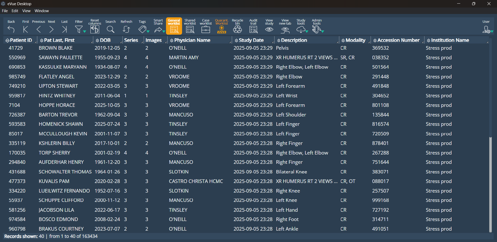
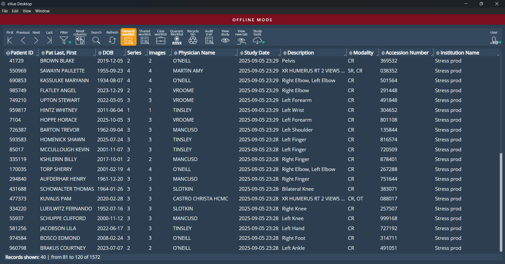
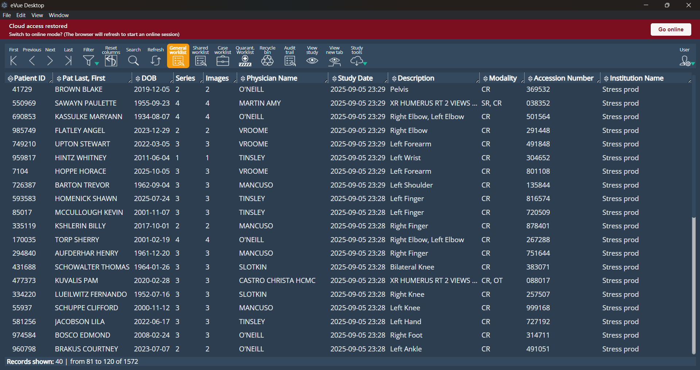
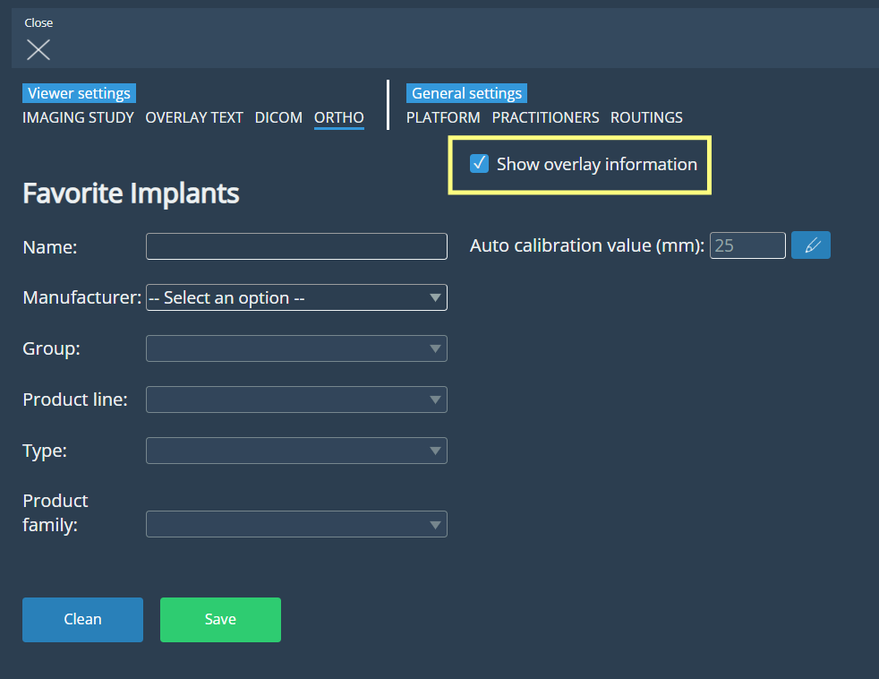
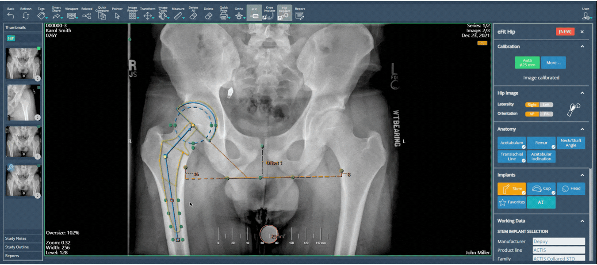
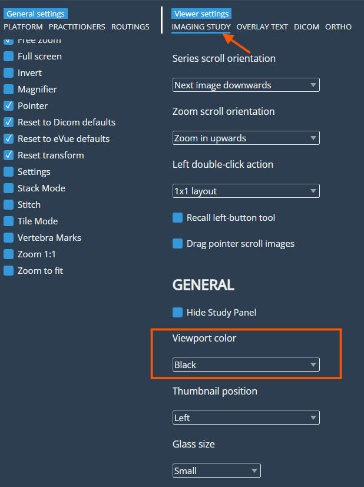
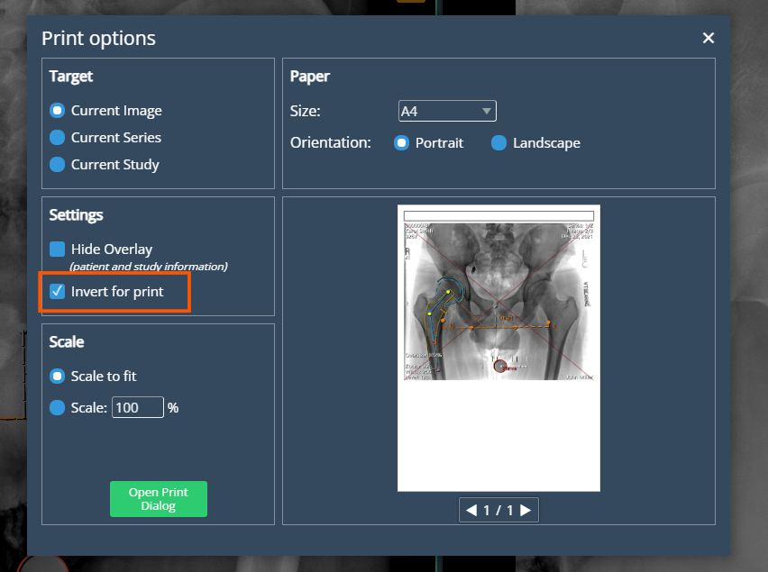

<br/>

# Release Notes

```
Product Name:   eVue and eFit
Version Number: 5.39
Release Date:   February, 2026
```

## Table of Contents

1. [Introduction](#introduction)
2. [New Features](#new-features)
3. [Improvements](#improvements)
4. [Deprecations](#deprecations)
5. [Known Issues](#known-issues)
6. [Upcoming Features](#upcoming-features)

## Introduction

Welcome to the February 2026 release of Efferent eVue. This update introduces *eVue Desktop*, a desktop version of eVue designed to provide a more stable and responsive user experience. It also includes enhancements to the *eFit interface and navigation*, along with new options such as *viewport background color selection* and *image inversion for printing.*

## New Features

### eVue Desktop

A new eVue Desktop application has been developed to provide a more fluid and stable user experience. This desktop version enables users to continue working even without an active internet connection by accessing imaging studies previously stored in the SmartLink cache.



When the application detects that the system is operating without connectivity to the cloud, it automatically switches to **offline mode**. During this state, a subtle red indicator bar will appear in the interface to inform the user that the application is currently operating offline. Users can continue reviewing studies that are available in the local cache.



When the connection to the cloud is restored, an informational message will appear, allowing the user to reconnect and resume normal online operation.



## Improvements

### eFit Interface and Navigation Improvements

The eFit panel has been updated to improve navigation and interface organization. By default, the eFit panel now opens docked on the right side of the screen. Drag-and-drop repositioning remains available, allowing the panel to be moved freely and docked on either side of the screen.


The panel is now structured into collapsible sections arranged in a logical, sequential order. The Calibration section has been moved to the top of the panel, and the AI functionality has been relocated into the Implants section. The Adjust control is no longer available.

The “Show in Print” option has been removed from the eFit panel and replaced with a new “Show overlay information” checkbox located in ORTHO Settings, allowing users to control the display of informational overlays in the viewport.



Implants can now be repositioned by holding the left mouse button and rotated by holding the right mouse button, offering more intuitive control during templating. Additionally, implant sizing can now be adjusted directly using the mouse scroll wheel, resulting in a smoother and more efficient workflow.



### Viewport background color selection

A new option has been added to the Imaging Study settings under General → Viewport Color, allowing users to choose between a blue or black background for image visualization in the viewports.



### Invert option enabled for printing

A new “Invert Image” checkbox has been added to the print settings, allowing users to invert the black-and-white colors of the original image when printing. The option is located below 'Hide Overlay'. When enabled, the system inverts the original image source used for printing, independently of any viewport adjustments, while keeping existing annotations visible. When disabled, printing follows the standard rendering behavior. The functionality was also extended to ensure the entire series is inverted when applied.



## Deprecations

None

## Known Issues

None

## Upcoming Features

None

---

Thank you for being a valued user of Efferent. We hope these updates enhance your experience. For any questions or feedback, please contact our support team at support@efferenthealth.com .